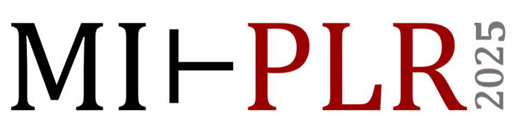

---
# Feel free to add content and custom Front Matter to this file.
# To modify the layout, see https://jekyllrb.com/docs/themes/#overriding-theme-defaults

#layout: home
---

{: width="90%" }

# MIT Programming Languages Review Workshop

The mission of the MIT PL Review is to highlight recent developments that we believe have significant potential to shape the future direction of PL research and/or industry practice. We aim to select papers that may substantially transform the PL community and beyond, with a focus on emerging trends rather than established lines of research. We favor papers whose contributions are broadly accessible (and likely to be appreciated) across the PL community, but we do not limit the papers to those published at PL venues. Our selection process is not meant to provide an objective evaluation of works but rather to highlight and celebrate works that resonated with our committee members.

The MIT PLR Workshop 2026 will be held on May 8th! Stay tuned for our selected papers, program details, and registration information to be announced soon! In the meantime you can see last year's program [here](plr2025.md).

# PL Review Program Committee

- David Akeley
- Ellie Cheng
- Teodoro Collin
- Vivian Ding
- Kavi Gupta (Program Chair)
- Dustin Jamner
- Amanda Liu 
- Jiazheng Liu (Conference Chair)
- Upamanyu Sharma
